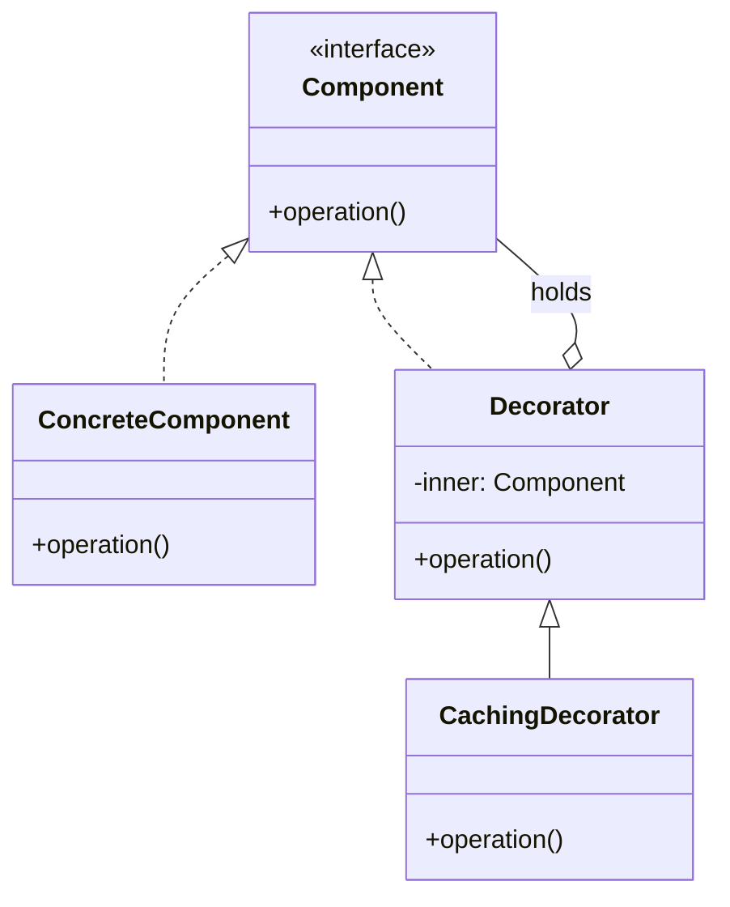

# LLD-20 — Decorator & UML Diagrams

*The second structural pattern, plus the visual vocabulary you'll need for every pattern still ahead.*

> This README is the **full lesson in long form**. If you'd rather click through interactive quizzes, open [`index.html`](./index.html). If you want to run the patterns, the [`code/`](./code/) directory has 9 self-contained Python examples plus a Mermaid diagram companion file — all `python3`-runnable with no dependencies.

---

## Table of contents

1. [At a glance](#at-a-glance)
2. [Recap — tricky & variation questions on Strategy & Observer](#recap--tricky--variation-questions-on-strategy--observer)
3. [Where we are after today](#where-we-are-after-today)
4. [Part 1 — Decorator](#part-1--decorator)
   - [The problem](#the-problem--subclass-explosion)
   - [The pattern](#the-pattern--wrap-dont-subclass)
   - [Python's @-syntax](#pythons--syntax)
   - [Real-world examples](#decorator-in-the-wild)
   - [Pitfalls](#decorator-pitfalls)
   - [When to use](#when-decorator-earns-its-keep)
5. [Part 2 — UML Diagrams](#part-2--uml-diagrams)
   - [Why UML](#why-uml)
   - [Class diagrams](#class-diagrams)
   - [Sequence diagrams](#sequence-diagrams)
   - [Common mistakes](#common-uml-mistakes)
   - [Tools](#tools)
6. [Compare — Decorator vs Adapter vs Proxy vs Facade](#compare--decorator-vs-adapter-vs-proxy-vs-facade)
7. [Cross-family check — updated for Decorator](#cross-family-check)
8. [Summary mindmap](#summary-mindmap)
9. [Interview cheat sheet](#interview-cheat-sheet)
10. [Code companions](#code-companions)
11. [Further reading](#further-reading)

---

## At a glance

Today pairs a new pattern (**Decorator**, second of seven structural patterns) with the meta-tool you'll need for every remaining pattern AND every LLD interview: **UML diagrams**.

**Decorator** — when you want to add caching, logging, retry, auth, or timing to an object's behaviour *without* changing the object and *without* changing its callers, wrap it. Same interface; stacks freely.

**UML** — the visual vocabulary for talking about classes and their relationships. Two diagram types do 95% of backend LLD work: **class diagrams** (structure) and **sequence diagrams** (flow over time). The five relationship arrows are inheritance, realisation, composition, aggregation, dependency.

The pairing isn't accidental: Decorator's UML is the trickiest in the GoF book (a wrapper that implements the interface it holds), and you can't talk about it cleanly without the right vocabulary. Learn the pattern AND the language for it in the same class.

---

## Recap — tricky & variation questions on Strategy & Observer

These aren't basic "what is Strategy" recall questions. They're the kind that distinguish someone who memorised the textbook UML from someone who actually understands the patterns.

### Strategy — the edge cases

#### Quiz 1 — Is this Strategy? Where?

```python
from django.db.models import Q

def search_users(query: str, scope_filter):
    qs = User.objects.filter(name__icontains=query)
    if scope_filter is not None:
        qs = qs.filter(scope_filter)
    return qs

# Usage:
search_users("ada", scope_filter=Q(team="eng") | Q(team="design"))
search_users("ada", scope_filter=Q(role__in=["admin", "owner"]))
search_users("ada", scope_filter=None)
```

**Answer: Yes, `scope_filter` is the strategy.** The fixed algorithm is the search (icontains then optional filter). The Django `Q` object is the swappable algorithm parameter.

Strategy doesn't require a class hierarchy with `ABC` + concrete subclasses — that's just the textbook UML. The pattern is *"fixed algorithm + one open parameter that parameterises a step."* A Django `Q` object passed into a function that runs a fixed query pipeline is exactly that. So is a SQL `WHERE` clause string passed into a reporting function, a regex pattern passed into a redactor, or a comparator passed into a tree's `insert()`. The *shape of the parameter* doesn't change what pattern it represents.

> **Interview soundbite:** "If you can answer the question *'what one open parameter changes how the algorithm runs?'*, you've found the Strategy — class hierarchy or not."

#### Quiz 2 — Strategy with state

```python
class RateLimitedPricing(PricingStrategy):
    def __init__(self):
        self._calls_this_minute = 0
        self._minute_start = time.time()

    def price(self, cart):
        if time.time() - self._minute_start > 60:
            self._calls_this_minute = 0; self._minute_start = time.time()
        self._calls_this_minute += 1
        if self._calls_this_minute > 100: raise RateLimitExceeded()
        return cart.subtotal * 1.18

# Wired into the app:
checkout1 = Checkout(pricing=RateLimitedPricing())
checkout2 = Checkout(pricing=RateLimitedPricing())
```

**Answer: the pattern allows state, but the wiring above creates a bug.** Each `Checkout` has its own rate limiter. Two parallel Checkouts each get their own 100/min quota, so the "global" limit isn't global at all.

The pattern doesn't forbid state in a Strategy; PyTorch optimizers (Adam carries momentum buffers) and HTTP retry strategies (exponential-backoff counter) are everyday examples. The mistake is in the *wiring*:

- If you construct one Strategy instance and pass it into many Contexts → state is shared (what's usually wanted here).
- If each Context constructs its own Strategy → state is per-Context (often a subtle bug).

The *fix* is to make the lifecycle of the Strategy match the scope of the state it owns. A global rate-limiter wants one instance; a per-request retry counter wants a fresh instance per request.

> **Interview soundbite:** "Strategy can have state — just be deliberate about how many instances you construct, because that determines whose state is shared."

#### Quiz 3 — Strategy vs config parameter

```python
# Code A
def connect(host: str, port: int, timeout_seconds: int = 5):
    sock = socket.create_connection((host, port), timeout=timeout_seconds)
    return sock

# Code B
def connect(host: str, port: int, backoff: Callable[[int], float]):
    for attempt in range(5):
        try:
            return socket.create_connection((host, port))
        except OSError:
            time.sleep(backoff(attempt))  # ← caller controls the WAIT FORMULA
    raise ConnectionError

# Usage:
connect("db.example.com", 5432, backoff=lambda n: 2 ** n)    # exponential
connect("db.example.com", 5432, backoff=lambda n: n * 0.5)   # linear
```

**Answer: only B is Strategy.** A's parameter is a *value* the function uses; B's parameter is a *function* that runs to decide how to behave at each step.

The line between "config" and "Strategy":

- A **config parameter** is a value the function *uses directly* (a number, a string, an enum). The function still controls what it does; the value just tunes the result.
- A **Strategy parameter** is a piece of executable behaviour (a callable, a class with a method) that *the function calls into*. The caller controls *how* a sub-step is performed.

> **Heuristic:** if the parameter type is `Callable[...]` / a class instance / a function reference — it's Strategy. If it's `int` / `str` / `bool` / `Enum` — it's config.

#### Quiz 4 — Strategy + concurrency

Two threads share one `Checkout`. One thread swaps `self.discount` mid-call:

```python
class Checkout:
    def __init__(self):
        self.discount: DiscountStrategy = NoDiscount()

    def total(self, order, user) -> float:
        subtotal = order.total
        # [point X] ← another thread can mutate self.discount between
        # these two lines
        discount_value = self.discount.calculate(order, user)
        return subtotal - discount_value
```

**Answer: the total can be computed using a strategy the caller never asked for.** Thread T1 enters with `LoyaltyDiscount`; T2 swaps in `NoDiscount` at point X; T1's `total()` finishes with `NoDiscount`. The bug is invisible because both produce valid totals.

Setter-based Strategy wiring is a hidden race condition when the Context is shared across threads or async tasks. Two clean fixes:

- **Snapshot once per call:** `strategy = self.discount; ...` at the top of `total()`. The rest of the method uses the local. Mid-call swaps land on the next call instead.
- **Pass the strategy per-call** — `checkout.total(order, user, discount=...)`. No shared state at all.

The GIL doesn't help here — it only makes individual bytecodes atomic, not multi-step reads of an instance attribute.

### Observer — the edge cases

#### Quiz 5 — Spot the leak

```python
class PriceTicker:
    def __init__(self):
        self._listeners: list[Callable[[float], None]] = []

    def subscribe(self, listener): self._listeners.append(listener)

    def tick(self, price):
        for l in self._listeners: l(price)

ticker = PriceTicker()    # app-global, lives forever

class ChartWidget:
    def __init__(self, ticker):
        self._prices = []
        ticker.subscribe(self._on_tick)   # bound method ref

    def _on_tick(self, price):
        self._prices.append(price)
        self.redraw()

# Every time the user opens a chart popup, a new ChartWidget is constructed
def show_chart_popup():
    widget = ChartWidget(ticker)
    render(widget)
    # ← popup closes; widget falls out of THIS function's scope
```

**Answer: every popup creates a `ChartWidget` that `ticker._listeners` holds onto forever.** Each holds its `_prices` list which keeps growing on every tick. After 1000 popups: 1000 zombie widgets, all still appending and trying to `redraw()`.

The bound method `self._on_tick` keeps a strong reference to `self` (the widget). When the popup closes, the function-scope reference disappears — but the ticker's `_listeners` list still holds the bound method, which still holds the widget. GC can't free it.

Three production fixes:

- **Always pair subscribe/unsubscribe** — the widget calls `ticker.unsubscribe(self._on_tick)` on close. (Hardest to enforce; somebody always forgets.)
- **`weakref.WeakMethod`** — the listener slot holds a weak ref; GC can reclaim the widget when the user's last strong ref is gone.
- **`weakref.WeakSet`** for the entire listener registry — Django Signals does this by default.

The bug is silent because each widget's `redraw()` usually doesn't error — it just no-ops on a hidden DOM node. The memory line on the chart is the only signal.

#### Quiz 6 — Observer that publishes (cycle hazard)

```python
class Inventory:
    def on_order_paid(self, event):
        self.decrement(event.sku, event.qty)
        if self.level(event.sku) < LOW_STOCK_THRESHOLD:
            event_bus.publish(LowStockEvent(event.sku))   # publishes

class Procurement:
    def on_low_stock(self, event):
        po = self.create_purchase_order(event.sku)
        event_bus.publish(PurchaseOrderCreated(po))       # publishes

class Inventory:
    def on_purchase_order_created(self, event):
        self.reserve_incoming(event.po)
        if self.level(event.po.sku) < LOW_STOCK_THRESHOLD:
            event_bus.publish(LowStockEvent(event.po.sku))   # publishes again!
```

**Answer: an infinite loop.** LowStock → PurchaseOrderCreated → LowStock → … The Inventory observer's "low stock" check fires before the new reservation actually raises stock past the threshold, so it republishes LowStock. The cascade never terminates.

Observers that publish are *not* forbidden by the pattern — but they create dependency graphs that can cycle. Three guards:

- **Make observer logic idempotent.** A second LowStock for the same SKU within a window is a no-op.
- **Route through a queue, not in-process bus.** Each publish lands in a queue; cycles become observable rate spikes you can detect and break.
- **Distinguish "state change" from "command".** Observers should react to facts ("the order is paid"); they shouldn't issue commands ("now please buy more stock") — that's the Mediator's job.

The deeper principle: in a graph of *"my reaction is another's trigger"*, you don't have Observer anymore — you have a poorly-defined workflow. Either accept that and use a workflow engine (Temporal, Airflow, Step Functions), or break the cycle with explicit idempotency.

#### Quiz 7 — Observer vs Mediator

You're designing a Slack-like chat room. 100 users in a channel. When User A sends a message, every other connected user should see it. Some users have notifications muted; some are typing-indicators; some are bots that auto-react.

**Answer: Mediator, not Observer.** The channel is a Mediator that *knows about all participants* and coordinates who hears what under which conditions (muted, online, bot).

Subtle distinction:

- **Observer:** the Subject doesn't know *who* the observers are or what they do. Observers don't talk to each other. The Subject just emits; observers react independently.
- **Mediator:** a central object knows about *all* the participants and coordinates their interaction — including filtering (muted users), conditional dispatch (bots vs humans), and cross-participant rules.

A chat channel sits in the Mediator camp because it doesn't just blast messages; it *decides* who gets what based on participant state. Pure Observer would broadcast to all subscribers unconditionally.

> **One-line discriminator:** Observer says "I'll fire; whoever cares can listen." Mediator says "I know everyone; I'll route."

#### Quiz 8 — Notification ordering

Two observers care about `OrderPaid`. The "send email" observer must run AFTER the "warehouse reserve" observer (because the email includes the tracking number that warehouse generates). How do you handle this?

**Answer: don't — this isn't Observer territory anymore.** Observer fits when reactions are independent. Email-needs-warehouse-output is a **workflow / Chain of Responsibility**: warehouse runs, returns a result, the next step uses it.

The moment one observer's output feeds another, you've violated the pattern's core promise of independent observers — and any ordering scheme you bolt on (priorities, sort keys, registration order) is a workaround that hides the real coupling.

Two clean fixes:

- **Chain of Responsibility / pipeline:** a single `handle_paid_order` function calls `tracking = warehouse.reserve()`, then `email.send(tracking)`. Order is explicit in code.
- **Two-stage events:** warehouse subscribes to `OrderPaid`; when it finishes, *warehouse* publishes `WarehouseReserved(tracking_number)`; email subscribes to that. The coupling is encoded in the event types, not in priorities.

Either way: observers stay independent within each event type.

#### Quiz 9 — Late subscriber / replay

A new analytics observer is added at 2pm. It needs the order events from 9am-2pm. Can plain Observer handle this?

**Answer: no.** In-memory Observer fires only forward, from subscription onward. For "consume from a point in the past", you need a durable log (Kafka, Redis Streams, EventStore) where late subscribers replay from an offset.

"Late subscriber needs old events" is the textbook reason to graduate from in-process Observer to an event broker. Plain Observer holds no history — events are fire-and-forget against whoever is registered *at notification time*.

> **Interview soundbite:** "Observer = ephemeral, in-process, no history. Broker = durable, cross-process, replayable. Same pattern shape, different scaling axis."

---

## Where we are after today

After this class:

- **5/5 Creational** — Singleton, Builder, Factory Method, Abstract Factory, Prototype
- **2/7 Structural** — Adapter (LLD-18), **Decorator (today)**
- **2/11 Behavioural** — Strategy, Observer (LLD-19)

That's **9 of 23 GoF patterns** under your belt. The remaining 14 mostly share the same UML notation — that's why we're learning UML today: it's the meta-tool that lets us learn the rest faster.

---

## Part 1 — Decorator

### The problem — subclass explosion

Riya is building an API client. The base client works:

```python
class ApiClient:
    def get(self, url: str) -> dict:
        return requests.get(url).json()
```

Over six months the requirements pile up: caching, retry, logging, auth, rate-limiting. Lean on inheritance and the family explodes:

```python
class CachingApiClient(ApiClient): ...
class RetryingApiClient(ApiClient): ...
class LoggingApiClient(ApiClient): ...
class AuthenticatedApiClient(ApiClient): ...
class RateLimitedApiClient(ApiClient): ...

# What if someone wants caching AND retry?
class CachingRetryingApiClient(ApiClient): ...

# What about caching AND retry AND logging?
class CachingRetryingLoggingApiClient(ApiClient): ...

# All five concerns combined?
class CachingRetryingLoggingAuthenticatedRateLimitedApiClient(ApiClient): ...
                                            # 5! = 32 combinations 😱
```

Three things have gone wrong:

- **Combinatorial explosion.** N orthogonal features → up to 2<sup>N</sup> subclasses. Most never get written and the ones that do duplicate code.
- **Order matters — but inheritance hides it.** "Caching then retry" behaves differently from "retry then caching"; a single class can only encode one order.
- **Multiple inheritance breaks MRO.** Mixing `CachingApiClient` and `RetryingApiClient` via multiple inheritance leads to subtle `super()` resolution bugs.

The shape of the problem: we have *one* core behaviour (make a request) and *several orthogonal behaviours* (cache, retry, log, auth, rate-limit) we want to compose freely.

### The pattern — wrap, don't subclass

> *Build small "wrapper" classes that take an object, expose the same interface, and add behaviour before/after delegating to the wrapped object. Stack wrappers to compose features.*

Three roles:

```
   Component (interface)
        △
        | implemented by
        |
   ┌────┴────┐
   │         │
ConcreteComp │
             │ implements + holds
             │
         Decorator (abstract)
             △
             |
    ┌────────┼────────┐
    │        │        │
  Caching  Retry   Logging   ...
```

The trick: the `Decorator` both *implements* the `Component` interface AND *holds* a `Component`. That self-similar shape is what allows wrappers to wrap wrappers indefinitely.

```python
from abc import ABC, abstractmethod

# 1. The Component interface
class ApiClient(ABC):
    @abstractmethod
    def get(self, url: str) -> dict: ...


# 2. The ConcreteComponent — does the actual HTTP work
class BasicApiClient(ApiClient):
    def get(self, url: str) -> dict:
        return requests.get(url).json()


# 3. Decorators — each wraps an ApiClient and exposes the same interface
class CachingDecorator(ApiClient):
    def __init__(self, inner: ApiClient):
        self._inner = inner                       # HOLDS a Component
        self._cache: dict[str, tuple[float, dict]] = {}

    def get(self, url: str) -> dict:
        now = time.time()
        if url in self._cache:
            ts, payload = self._cache[url]
            if now - ts < 60:
                return payload                    # cache hit
        payload = self._inner.get(url)            # delegate
        self._cache[url] = (now, payload)
        return payload


class RetryDecorator(ApiClient):
    def __init__(self, inner: ApiClient, attempts: int = 3):
        self._inner = inner
        self._attempts = attempts

    def get(self, url: str) -> dict:
        last_exc = None
        for i in range(self._attempts):
            try:
                return self._inner.get(url)
            except requests.RequestException as e:
                last_exc = e
                time.sleep(2 ** i)
        raise last_exc


class LoggingDecorator(ApiClient):
    def __init__(self, inner: ApiClient):
        self._inner = inner

    def get(self, url: str) -> dict:
        log.info("GET %s", url)
        payload = self._inner.get(url)
        log.info("GET %s → %d bytes", url, len(str(payload)))
        return payload
```

Now stack them in any order:

```python
client = LoggingDecorator(RetryDecorator(CachingDecorator(BasicApiClient())))
client.get("https://api.example.com/users/1")
```

|  | Before (inheritance) | After (Decorator) |
|---|---|---|
| Class count | Up to 2⁵ = 32 subclasses | 5 decorator classes |
| Order | Locked into each class | Decided at runtime |
| Adding a feature | Editing the family tree | One new class |

The win is OCP — for real this time. Adding `RateLimitDecorator` means *writing one new class*. Nothing else in the codebase changes.

### Python's @-syntax

When the thing being wrapped is a *function* (not an object), Python ships built-in syntax for this:

```python
from functools import wraps

def log_calls(func):
    @wraps(func)                # preserve func.__name__, __doc__
    def wrapper(*args, **kwargs):
        logging.info("calling %s", func.__name__)
        result = func(*args, **kwargs)
        logging.info("→ %s", result)
        return result
    return wrapper


@log_calls                      # equivalent to: greet = log_calls(greet)
def greet(name: str) -> str:
    return f"Hello, {name}"
```

The `@` syntax is just sugar. These two are identical:

```python
# Sugar:
@log_calls
def greet(name): return f"Hello, {name}"

# Desugared:
def greet(name): return f"Hello, {name}"
greet = log_calls(greet)        # ← this IS the wrapping
```

Stacking works the same way:

```python
from functools import cache

@log_calls                      # outer
@cache                          # inner
def fib(n: int) -> int:
    return n if n < 2 else fib(n - 1) + fib(n - 2)

# Equivalent to: fib = log_calls(cache(fib))
# Reading order: closest to the function = innermost.
```

> **Decorator (pattern) vs Python `@decorator` (syntax)** — the GoF Decorator pattern is about *objects*; Python's `@` syntax is about *functions*. They share the core idea (transparent wrapping) but differ in granularity. In Python, when adding cross-cutting behaviour to functions, use `@`. When adding it to objects with multiple methods, use the GoF class-based shape.

### Decorator in the wild

- **`functools.lru_cache` / `functools.cache`** — memoisation as a decorator. The most-used Decorator in the Python stdlib.
- **Django / FastAPI middleware** — HTTP request decorators. Both frameworks let you stack middleware classes that wrap every request. Each middleware sees the request, optionally modifies it, calls the next layer, sees the response, optionally modifies it. That's literally the Decorator pattern at the request level.
- **Java I/O streams** — the textbook GoF example. `DataInputStream(new BufferedInputStream(new FileInputStream("data.bin")))` — each layer adds one orthogonal capability.
- **`@login_required`, `@app.route`, `@pytest.fixture`** — every web framework decorates view functions. Test frameworks decorate fixtures. None of these subclass — they all wrap.

### Decorator pitfalls

#### Pitfall 1 — Order matters

```python
order_A = CachingDecorator(RetryDecorator(BasicApiClient()))
order_B = RetryDecorator(CachingDecorator(BasicApiClient()))
```

Both stack a Cache + Retry around the basic client. Functionally similar in the happy path, but:

- **Cache outside Retry:** cache check runs first; on miss, retry does the work and the successful response is cached. (Usually what you want.)
- **Retry outside Cache:** retry runs first; each retry hits the cache. If cache stores errors, retries are no-ops. If cache only stores successes, the inner cache is wasted on a single request.
- **Logging outside Auth:** log entries see unauthed requests. Useful for debugging, sensitive for auditing.
- **Logging inside Auth:** only authed requests are logged. Cleaner audit log, but you miss attempted-auth-failed cases.

> **Rule:** each combination has a meaning — pick the order deliberately, document it, write a test for it.

#### Pitfall 2 — Forgetting `@functools.wraps`

```python
def add_timing(func):
    def wrapper(*args, **kwargs):
        return func(*args, **kwargs)
    return wrapper

@add_timing
def do_work():
    """The real work."""
    pass

print(do_work.__name__)   # 'wrapper'  ← bug!
print(do_work.__doc__)    # None       ← bug!
```

What breaks:

- Sphinx / pdoc / Pydantic documentation generation — all your functions appear named `wrapper`.
- Mock-and-spy in tests that match on `func.__name__`.
- Stack traces that print the wrapper's frame instead of the meaningful function name.

The fix is one line:

```python
from functools import wraps

def add_timing(func):
    @wraps(func)                # ← copies __name__, __doc__, signature
    def wrapper(*args, **kwargs):
        return func(*args, **kwargs)
    return wrapper
```

Every Python decorator you write should have `@wraps(func)` on its inner wrapper. No exceptions.

### When Decorator earns its keep

| ✅ Use Decorator when | ❌ Skip Decorator when |
|---|---|
| Adding cross-cutting concerns (caching, logging, retry, auth, timing) | Only one cross-cutting concern — just add it directly |
| Would otherwise write N×M subclasses | Need to *change* the interface, not just augment it — that's **Adapter** |
| Different combinations and orders needed in different code paths | The component has 20 methods — you'd forward them all; consider `__getattr__` |
| Wrapped thing has a small, stable interface | Want to control access (lazy-load, remote-call), not add behaviour — that's **Proxy** |

---

## Part 2 — UML Diagrams

### Why UML

The honest pitch. In real engineering work, you don't draw beautiful UML before coding — that's a 1990s idea. But you *will* need UML in three concrete situations every LLD engineer hits:

- **Interviews.** Every LLD interview asks you to "design X" on a whiteboard or Coderpad. The interviewer expects classes, arrows, and the right vocabulary for the relationships between them.
- **Onboarding.** When you join a team, the first thing they show you isn't the code — it's a diagram. You need to read it, and after a few months you'll be drawing one to explain the system to the next hire.
- **RFCs / design docs.** When you propose a non-trivial change, the doc almost always includes a class diagram showing the new relationships. Reviewers debate the diagram before debating the code.

Two diagram types do 95% of backend LLD work: **class diagrams** (structure) and **sequence diagrams** (flow over time).

### Class diagrams

#### The box

Each class is a rectangle with three sections: *name*, *attributes*, *methods*. Visibility markers:

- `+` public
- `-` private
- `#` protected
- *italics* = abstract
- <ins>underline</ins> = static

Example:

```
┌─────────────────────────────────┐
│        BankAccount              │
├─────────────────────────────────┤
│ - account_id: str               │
│ + balance: float                │
│ # owner: Customer               │
├─────────────────────────────────┤
│ + deposit(amount: float): None  │
│ + withdraw(amount: float): bool │
│ - _validate(amount: float): bool│
│ + transfer(a, b, amount) {static}│
└─────────────────────────────────┘
```

#### The arrows

This is where most students lose precision. Five arrows you actually need:

| Relationship | Arrow | Meaning | Example |
|---|---|---|---|
| **Inheritance** (is-a) | Solid + open triangle | Child extends parent | `SavingsAccount ──▷ BankAccount` |
| **Realisation** (implements) | Dashed + open triangle | Class implements abstract interface | `RazorpayAdapter - - -▷ PaymentGateway` |
| **Composition** (owns) | Filled diamond | Container owns part. Container dies, parts die. Parts can't exist alone. | `House ♦─── Room` |
| **Aggregation** (has) | Open diamond | Container holds part. Container dies, parts survive. | `Team ◇─── Player` |
| **Dependency** (uses) | Dashed arrow | Used briefly (parameter, return, local) | `OrderService - - -> EmailService` |

#### Composition vs Aggregation — the one most people get wrong

The discriminator is **lifetime ownership**:

- **Composition** when the contained object *cannot exist without* the container and dies with it. `Order/OrderLine`, `House/Room`, `Document/Paragraph`.
- **Aggregation** when the contained object exists independently and may be shared. `Team/Player` (players play for many teams over a career), `Playlist/Song`, `Course/Student`.

> **One-line discriminator:** "Can the part be passed to a different whole, or used after the whole is gone?" Yes → aggregation. No → composition.

#### Multiplicity

Numbers next to the endpoints say how many objects on each side:

- `1` — exactly one
- `0..1` — zero or one (optional)
- `*` or `0..*` — zero or more (a collection)
- `1..*` — one or more (non-empty collection)
- `n..m` — specific range

A relationship reads endpoints + arrow + endpoint: *"one `Order` ♦─── one-or-more `OrderLine`s"*, written as `Order   1 ♦───── 1..* OrderLine`.

#### The Decorator UML

Putting it together:

```
                <<interface>>
                  Component
                +-----------+
                | operation()|
                +-----------+
                  △       △
                  | impl  | impl
        ┌─────────┘       └─────────┐
        │                            │
ConcreteComponent              <<abstract>> Decorator
+-----------+                  +---------------------+
|operation()|                  | - inner: Component  |
+-----------+                  | operation()         |
                              +---------------------+
                                       △
                                       | inherits
                          ┌────────────┼────────────┐
                          │            │            │
                    CachingDec    RetryDec     LoggingDec

  Decorator HOLDS a Component (filled-diamond loop back to Component)
  ← that self-similar shape is what makes wrappers stackable
```

The purple arrow from `Decorator` back to `Component` is the self-similar trick: a `Decorator` holds a `Component` AND IS a `Component`. That's what lets you stack.

### Sequence diagrams

A class diagram tells you what objects *can* talk to each other. A sequence diagram tells you which calls actually happen, in what order, when a specific scenario plays out.

Conventions:

- **Actors / participants** sit across the top, each with a vertical *lifeline* hanging down.
- **Time runs top to bottom.**
- **Messages** are horizontal arrows from sender to receiver. Solid for synchronous calls, dashed for return values, open-triangle for async.
- **Activation bars** mark when a participant is "busy" executing.

A sequence diagram for the stacked client `LoggingDecorator(RetryDecorator(CachingDecorator(BasicApiClient())))` handling a cache miss + retry:

```
 Caller    LoggingDec   RetryDec   CachingDec   BasicClient
   │           │           │           │           │
   ├──get(url)→│           │           │           │
   │           │log "GET"  │           │           │
   │           ├─get(url)─→│           │           │
   │           │           ├─get(url)→ │           │
   │           │           │           ├─get(url)→ │
   │           │           │           │       (cache miss)
   │           │           │           ←────×──────┤
   │           │           │←──×───────┤       (raises)
   │           │           │  sleep(1) │           │
   │           │           ├─get(url)→ │           │
   │           │           │           ├─get(url)→ │
   │           │           │           │←─payload──┤
   │           │           │           cache[url]= │
   │           │           │←─payload──┤           │
   │           │←─payload──┤           │           │
   │           │ log "done"│           │           │
   ←──payload──┤           │           │           │
```

Three things this makes obvious that a class diagram couldn't:

- The **fan-in / fan-out shape** — outermost decorator called once; innermost called twice (retry).
- The **red dashed return on the first attempt** — an exception caught by RetryDecorator.
- The **self-message ("sleep")** on RetryDecorator — behaviour *between* outgoing calls is visible because time runs vertically.

### Common UML mistakes

1. **Using inheritance arrow for everything.** "Class A has a B" is *not* inheritance.
2. **Composition vs Aggregation by feel.** Most students draw composition for anything "owned." The discriminator is lifetime.
3. **Missing multiplicity.** Always add numbers for collections.
4. **Drawing every getter and setter.** UML is for communication, not documentation.
5. **Class diagram when you meant sequence.** If your point is "A calls B then C", you need a sequence diagram.

### Tools

| Tool | Best for |
|---|---|
| **Mermaid** | Text-based UML that renders in GitHub markdown. Best for design docs and PR descriptions. |
| **PlantUML** | Older, more featureful text-to-UML. Better for very large diagrams. |
| **draw.io / Excalidraw** | Mouse-driven. Best for interview whiteboarding practice and polished slides. |
| **PyCharm UML** | Right-click a Python file → Diagrams → Show Diagram. Auto-generates from code. |

> **Practice recommendation:** for design docs and interview prep, use Mermaid. It's plain text (versionable with the code), renders everywhere, and forces you to think in the formal vocabulary.

Mermaid example — paste into any GitHub markdown:



---

## Compare — Decorator vs Adapter vs Proxy vs Facade

All four structural patterns share the same UML shape on paper — one class holds another and forwards calls. The pattern name says *why* the wrapping exists, not how it's coded.

| Pattern | Intent | Wrapped's interface | Wrapper's interface | Example |
|---|---|---|---|---|
| **Adapter** | Make an existing object usable where a *different* interface is expected | Old/incompatible | The Target interface (different from wrapped) | RazorpayAdapter wraps RazorpayClient to expose PaymentGateway |
| **Decorator** | Add behaviour *around* an object without changing it | Some interface X | Same interface X, plus extra behaviour | CachingDecorator wraps ApiClient to add caching |
| **Proxy** | Stand in for an object — control access, lazy-load, or remote-call it | Some interface X | Same interface X (transparent stand-in) | ORM lazy-loading proxy looks like a User but fetches on first access |
| **Facade** | Hide a complex subsystem behind one simple front-door API | Many objects with many interfaces | A small, simpler new interface | OnboardTenant.start() that orchestrates 8 services |

### The four-question litmus test

- Does the wrapper expose a *different* interface? → **Adapter** (translate) or **Facade** (simplify many→one).
- Does the wrapper expose the *same* interface as what it wraps?
  - To *add* behaviour around calls? → **Decorator**.
  - To *control* when/whether the call happens? → **Proxy**.

### Decorator vs Proxy — the subtle pair

Both share an interface with the wrapped object. The discriminator:

- **Decorator's goal:** *enhance* (cache, log, retry, format).
- **Proxy's goal:** *gate-keep* (lazy-load, check permissions, batch remote calls, refuse forbidden ones).

A Proxy may add nothing functional; it just stands in. A Decorator always adds something the caller can observe.

### Decorator vs Strategy — the tricky cross-family pair

Both wrap behaviour. The difference:

- **Strategy** replaces an algorithm: the Context picks *one* Strategy for a method call. There's no chaining; the Strategy *is* the algorithm.
- **Decorator** wraps an existing algorithm: each layer runs behaviour *around* the call to the next layer. Multiple Decorators stack.

If you can stack two of them and both run → Decorator. If picking the second discards the first → Strategy.

---

## Cross-family check

"I want to vary something at runtime." — vary *what*?

- **Which concrete class to instantiate** → Factory
- **How interfaces fit together** → Adapter
- **What behaviour wraps an existing object's calls** → Decorator
- **Which algorithm to use for one job** → Strategy
- **Who reacts to one event** → Observer

---

## Summary mindmap

### 🎬 Decorator — *structural* — "wrap to add behaviour"

- **Use when:** adding cross-cutting concerns (cache / log / retry / auth / rate-limit) to an existing object's behaviour
- **Three roles:** Component (interface) · ConcreteComponent (real work) · Decorator (implements Component, holds Component)
- **Self-similar trick:** Decorator implements the same interface it holds — that's what enables stacking
- **Python flavours:** class-based wrappers for objects · `@decorator` syntax for functions (FastAPI/Django middleware, `functools.cache`)
- **Skip when:** one cross-cutting concern (just add it) · need different interface (Adapter) · need to control access not enhance (Proxy)
- **#1 bug:** forgetting `@functools.wraps` — the decorated function loses its `__name__`, `__doc__`, signature
- **#2 bug:** order matters — Cache-then-Retry and Retry-then-Cache behave differently

### 📝 UML — *communication tool* — "the visual vocabulary of design"

- **When you need it:** interviews · onboarding · RFCs / design docs
- **Two diagram types do 95%:** Class diagrams (structure) · Sequence diagrams (flow over time)
- **Five relationship arrows:**
  - Inheritance (is-a) — solid + open triangle
  - Realisation (implements interface) — dashed + open triangle
  - Composition (owns, lifetimes bound) — filled diamond
  - Aggregation (has-a, weakly) — open diamond
  - Dependency (uses briefly) — dashed arrow
- **Visibility markers:** `+` public · `-` private · `#` protected · underline = static · italics = abstract
- **Multiplicity:** `1` / `0..1` / `*` / `1..*` — always specify for collections
- **Tools:** Mermaid (in markdown) · PlantUML · draw.io · PyCharm UML
- **#1 mistake:** composition vs aggregation by feel — check the lifetime question

### 🎯 Structural cheat — "which wrapper pattern?"

- Different interface? → **Adapter** (one→one translate) or **Facade** (many→one simplify)
- Same interface, adds behaviour? → **Decorator**
- Same interface, controls access? → **Proxy**

---

## Interview cheat sheet

**If asked "when would you use Decorator?":** lead with cross-cutting concerns. Cache, log, retry, auth, rate-limit applied to existing behaviour. Mention `functools.cache` as the everyday Python example. Bonus: distinguish from Adapter (different interface) and Proxy (controls access).

**If asked "what's `@functools.wraps`?":** "It copies the original function's metadata (`__name__`, `__doc__`, signature) onto the wrapper so the decorator is transparent to introspection." Bonus: name what breaks without it (Sphinx, stack traces, type checkers).

**If asked "what's the difference between composition and aggregation?":** "Lifetime ownership. With composition, the part can't exist without the whole; with aggregation, it can." Bonus example: Order/OrderLine vs Team/Player.

**If asked to "draw the UML for X":** start with boxes; pick the right arrow for each pair; add multiplicities for collections; *annotate* the design decision (the bit that's interesting). Don't show 20 getters.

---

## Code companions

All Python files in [`code/`](./code/) are self-contained and `python3`-runnable with no dependencies.

| File | What it demonstrates |
|---|---|
| [`01_basic_class_decorator.py`](./code/01_basic_class_decorator.py) | The minimal class-based Decorator with three roles spelled out |
| [`02_function_decorator_basics.py`](./code/02_function_decorator_basics.py) | Python's `@`-syntax from first principles — desugared form, `@functools.wraps`, parametrised decorators, stacking |
| [`03_stacked_api_client.py`](./code/03_stacked_api_client.py) | Riya's 5-concerns problem solved — Logging(Auth(Cache(Retry(Basic)))). Structured for clean PyCharm UML rendering |
| [`04_decorator_vs_adapter.py`](./code/04_decorator_vs_adapter.py) | Same wrapping shape, two different intents — Decorator adds behaviour, Adapter translates the interface |
| [`05_django_middleware_pattern.py`](./code/05_django_middleware_pattern.py) | Django/FastAPI middleware built from scratch — the Decorator pattern at HTTP-request level |
| [`06_decorator_order_matters.py`](./code/06_decorator_order_matters.py) | Demonstrates with timing how Cache→Retry vs Retry→Cache differ — including a cache-poisoning bug |
| [`07_functools_wraps_demo.py`](./code/07_functools_wraps_demo.py) | Side-by-side comparison of WITH vs WITHOUT `@functools.wraps` — shows what breaks |
| [`08_class_based_decorators.py`](./code/08_class_based_decorators.py) | When to use class-based decorators (stateful: `CountCalls`, `Memoize` with stats, `RateLimit`) |
| [`09_uml_friendly_design.py`](./code/09_uml_friendly_design.py) | E-commerce domain showing all 5 UML relationships — inheritance, realisation, composition, aggregation, dependency. Open in PyCharm to verify the diagram |
| [`10_mermaid_diagrams.md`](./code/10_mermaid_diagrams.md) | Mermaid-syntax UML for Decorator, all 5 relationships, sequence diagram, plus Strategy & Observer recap. Renders directly on GitHub |

### Viewing the UML diagram in PyCharm

`03_stacked_api_client.py` and `09_uml_friendly_design.py` are both structured for PyCharm's UML class-diagram view:

1. Open the file in PyCharm.
2. Right-click → **Diagrams** → **Show Diagram…** → **Python Class Diagram**.
3. PyCharm reads the code and renders the class structure automatically — every arrow corresponds to one of the five UML relationship types.

For `09_uml_friendly_design.py`, you should see exactly five distinct relationship arrows: inheritance (SavingsAccount → Account), realisation (RazorpayGateway → PaymentGateway), composition (Order → OrderLine), aggregation (Cart → Product), and dependency (OrderService → PaymentGateway).

---

## Further reading

### Decorator

- 🎨 **[Refactoring.Guru — Decorator](https://refactoring.guru/design-patterns/decorator)** — diagrams and the canonical GoF version.
- 📝 **[`functools` — Python docs](https://docs.python.org/3/library/functools.html)** — `cache`, `lru_cache`, `wraps`, `partial`. Read once.
- 🌐 **[Django Middleware](https://docs.djangoproject.com/en/stable/topics/http/middleware/)** — production decorator-pattern usage at the HTTP request level.
- 🔗 **[Real Python — Primer on Decorators](https://realpython.com/primer-on-python-decorators/)** — the most complete tutorial on Python's `@` syntax.

### UML

- 🎮 **[Mermaid — Class Diagram syntax](https://mermaid.js.org/syntax/classDiagram.html)** — the text-to-UML syntax. Bookmark this.
- ⏱️ **[Mermaid — Sequence Diagram syntax](https://mermaid.js.org/syntax/sequenceDiagram.html)** — for showing flow over time.
- 🎓 **[PlantUML reference](https://plantuml.com/class-diagram)** — bigger feature set than Mermaid; useful for large diagrams.
- 🎨 **[draw.io](https://app.diagrams.net/)** — free, browser-based, mouse-driven. Good for whiteboarding practice.

> **Honest advice:** spend 30 minutes on Mermaid's class-diagram syntax page and draw the UML for one pattern you already understand (Builder or Adapter). That single exercise is worth more than reading three theory books on UML.

---

## After this class

- **Next class** (LLD-21): **Types of LLD Interviews + How to Approach LLD Problems** — meta-skills, then the classic problems.
- **Then** (LLD-22-23): **Design & Code TicTacToe** — first end-to-end LLD problem.

---

*LLD-20: Decorator & UML Diagrams · Academy Feb 26 — Python Backend LLD Batch*
