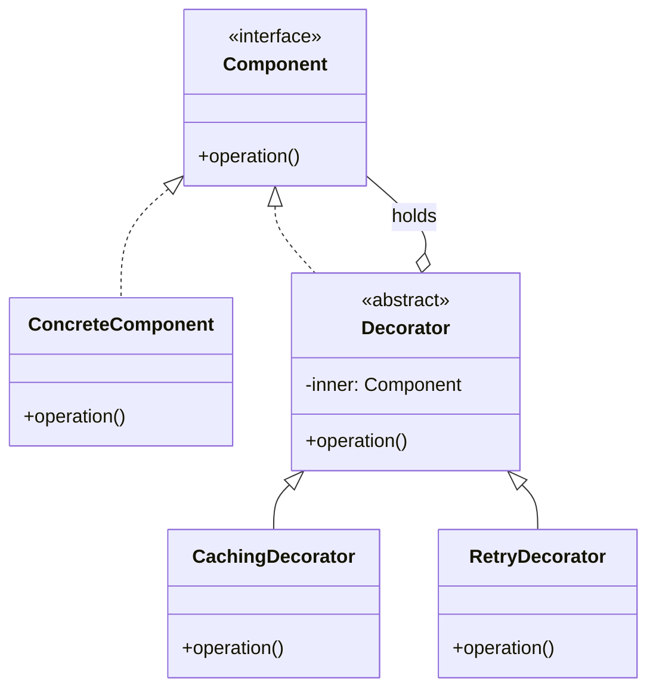
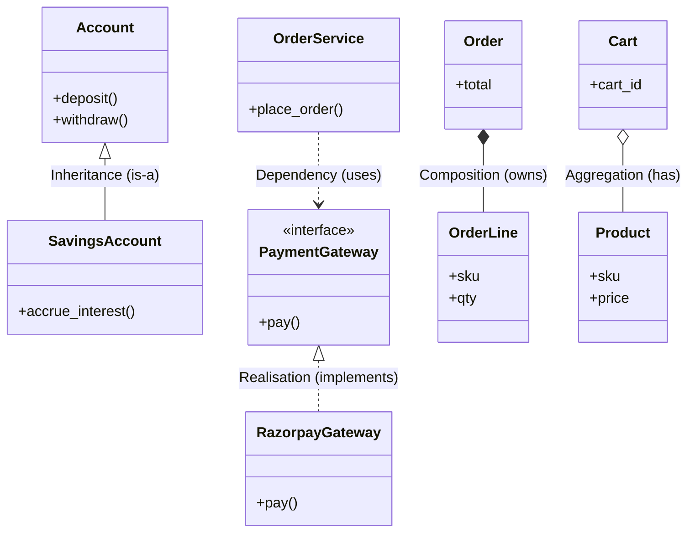
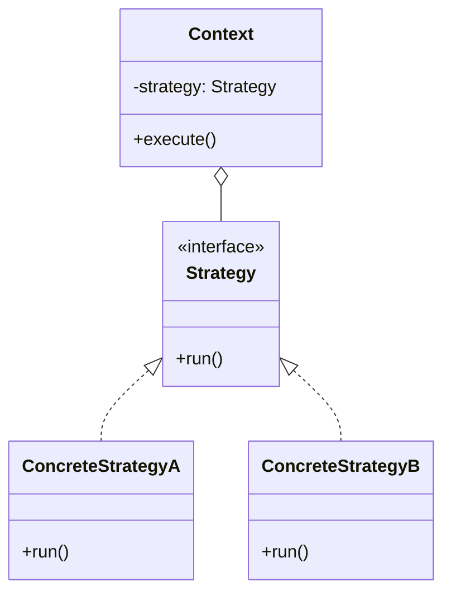
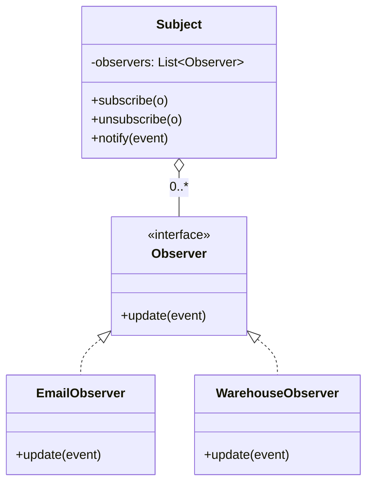
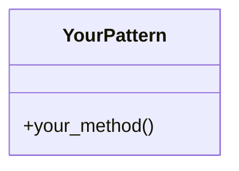

# LLD-20 · UML · Example 10 — Mermaid diagrams you can paste anywhere

> This file is the "tool" companion to the UML section. Every Mermaid block
> below renders as a real diagram in GitHub markdown, GitLab, Notion, MkDocs,
> Obsidian — anywhere Mermaid is supported.
>
> Open this file on github.com (or paste into a GitHub markdown preview)
> and you'll see the diagrams rendered. The source is plain text, so you can
> version it alongside the code it describes.

---

## 1. The Decorator pattern UML (matches the class diagram in the lesson)



The key trick: the `Decorator` both implements `Component` AND holds one
(`o--`). That self-similarity is what makes wrappers stackable.

---

## 2. The five relationship arrows, all in one diagram



Read the arrows:

- `<|--` is solid + open-triangle = **Inheritance** (is-a)
- `<|..` is dashed + open-triangle = **Realisation** (implements interface)
- `*--` is filled diamond = **Composition** (whole owns part; lifetimes bound)
- `o--` is open diamond = **Aggregation** (whole has part; part can survive alone)
- `..>` is dashed arrow = **Dependency** (uses briefly)

---

## 3. Sequence diagram for the stacked API client retry

```mermaid
sequenceDiagram
    actor Caller
    participant L as LoggingDecorator
    participant R as RetryDecorator
    participant C as CachingDecorator
    participant B as BasicApiClient

    Caller->>L: get(url)
    Note right of L: log "GET url"
    L->>R: get(url)
    R->>C: get(url)  [attempt 1]
    C->>B: get(url)  [cache miss]
    B--xC: raises RequestException
    C--xR: propagates exception
    Note right of R: sleep(2^0); attempt 2
    R->>C: get(url)  [attempt 2]
    C->>B: get(url)
    B-->>C: payload
    Note right of C: cache[url] = payload
    C-->>R: payload
    R-->>L: payload
    Note right of L: log "GET url → N bytes"
    L-->>Caller: payload
```

This is the same flow as the SVG sequence diagram in the lesson — but written
as plain text. Paste it into any markdown file with Mermaid support and it
renders.

---

## 4. Strategy + Observer recap (cross-pattern reference)

### Strategy



### Observer



---

## 5. Practice exercise

Pick one pattern you've already learned in this course (Builder, Adapter,
Prototype, Singleton — any of them) and write its Mermaid class diagram
below. Compare with the SVG diagram in that pattern's HTML notes. If they
match, you've mastered both the pattern AND the UML notation.



When you can do this from memory for any pattern, the UML half of LLD-20
is internalised.
