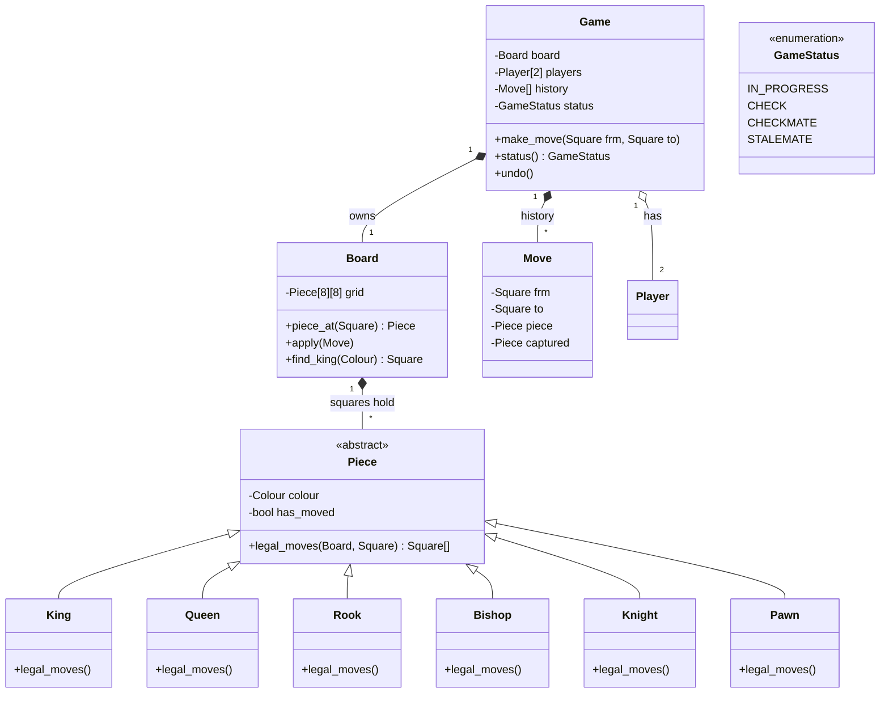

# Design Chess

> Companion case study to LLD-22 (Tic-Tac-Toe Design). The same skeleton survives — but Chess is where two of the Tic-Tac-Toe decisions flip, and seeing WHY they flip teaches more than either design alone.

## What is Chess?

Chess is a 2-player game on an 8×8 board. Each player commands 16 pieces of six kinds (king, queen, rook, bishop, knight, pawn), each with its own movement rules. Players alternate moves; capturing the opponent's king ending position (checkmate) wins. Stalemate, repetition, and agreement produce draws.

## Questions to ask

* Full chess rules, or a simplified subset? (Castling, en passant, and pawn promotion are each real work — confirm which are in scope.)
* Do we need check / checkmate / stalemate detection, or just legal piece movement?
* Human vs human only, or an engine opponent? If engine — how strong? (Random-legal-move bot vs minimax vs real engine are different projects.)
* Is move history / notation (PGN) required? Undo?
* Timed games (chess clocks)?
* One game per process, or a server hosting many games?
* Feature suggestions to offer: spectators, analytics, tournaments, ratings.

**Reasonable MVP scope** (confirm with interviewer): legal movement for all six pieces, turns, check + checkmate + stalemate detection, no castling / en passant / promotion, human vs human, CLI.

## Requirements (complete sentences)

1. The game is played on an 8×8 board of squares.
2. Two players play the game; one commands the white pieces and the other the black pieces.
3. Each player starts with sixteen pieces of six kinds, and each kind of piece moves according to its own rule.
4. The players take turns alternately, and white always moves first.
5. A player can move a piece only to a square permitted by that piece's movement rule, and a move may not leave the player's own king in check.
6. A piece that moves onto a square occupied by an opponent's piece captures it, and the captured piece leaves the board.
7. A player whose king is under attack is in check, and a player who has no legal move while in check is checkmated and loses the game.
8. A player who has no legal move while NOT in check causes a stalemate, and the game ends in a draw.
9. After every move, the players can see the full board state and the move history.

**Non-functional:** in-memory, single process; adding a new piece kind (fairy chess) is one new class; the engine/bot, if added later, plugs in behind the same Player contract.

## The two Tic-Tac-Toe decisions that FLIP — and why

### Flip 1: the cell's content becomes a class

In Tic-Tac-Toe we ruled that a cell is just a value (`Symbol | None`) because it holds exactly one thing. Run the same three-way test on a chess square's occupant:

- State? Yes — kind, colour, and has-it-moved (castling/double-step rights depend on it).
- Behaviour? Yes — each piece validates its own movement.

Same test, opposite answer: **`Piece` is a class** (an abstract one, with six subclasses). The test was never "is it a noun" — it was "does it carry state + behaviour".

### Flip 2: one rule becomes a rule hierarchy

Tic-Tac-Toe had ONE win rule scanning a uniform grid → a single `WinRule` strategy. In chess the variability lives **per piece**: a rook's legality logic and a knight's share nothing. So the Strategy moves INTO the piece hierarchy: each `Piece` subclass implements `legal_moves(board, from_sq)`. The game-over check (`checkmate?`) stays at Game level, but it delegates to the pieces.

## Entities and their attributes

| Entity | Kind | Notes |
|---|---|---|
| `Game` | class | Orchestrator: turns, move application, check/checkmate/stalemate detection, history. |
| `Board` | class | 8×8 grid of `Piece | None`. `piece_at(sq)`, `move(frm, to)`, `find_king(colour)`. |
| `Piece` | ABC | `colour`, `has_moved`. Abstract `legal_moves(board, from_sq) -> list[Square]`. |
| `King` `Queen` `Rook` `Bishop` `Knight` `Pawn` | classes | Each implements its own `legal_moves`. Pawn is the largest (direction, double-step, capture-diagonally). |
| `Colour` | enum | `WHITE`, `BLACK`. Same reasoning as Tic-Tac-Toe's `Symbol`. |
| `Square` | dataclass (frozen) | `(file, rank)` — a *value object*: two ints that travel together with validation, but no identity. Compare: Tic-Tac-Toe got away with bare `(row, col)` tuples; chess code reads `move(e2, e4)` so naming the pair pays for itself. |
| `Move` | dataclass | `frm`, `to`, `piece`, `captured` — the history entry. Storing `captured` is what makes undo trivial. |
| `GameStatus` | enum | `IN_PROGRESS`, `CHECK`, `CHECKMATE`, `STALEMATE`, `DRAW_AGREED`, `RESIGNED`. The Tic-Tac-Toe enum, grown — this is why we never used a bool. |

## Class diagram

Ownership notes:
- `Game ◆ Board`, `Game ◆ Move history` — composition: both meaningless outside this game.
- `Game ◇ Player` — aggregation, same tournament logic as always.
- `Board ◆ Piece` — composition: when this game's board goes, its pieces go. (A `User`'s profile would NOT — that distinction again.)

## Where undo stops being optional

In Tic-Tac-Toe, undo was a side assignment. In chess it's structural: the `Move` history (with `captured` stored) **is** the game record — notation, repetition-detection, and undo all read from it. `undo()` pops the last `Move`, puts `piece` back on `frm`, restores `captured` to `to`, flips the turn. Designing the `Move` dataclass with `captured` from day one is the difference between undo-in-10-lines and a rewrite.

This is the Memento idea without the ceremony: the history entries are your mementos.

## Patterns used

| Pattern | Where | Why |
|---|---|---|
| Polymorphism over Strategy objects | `Piece.legal_moves` per subclass | The varying logic IS per-type — a subclass method is the natural Strategy here. |
| Memento (lightweight) | `Move` history with `captured` | Undo, notation, repetition detection — all from one list. |
| Same as TTT | orchestrator, status enum, turn pointer, render/logic split | Carried over unchanged. |
| Factory (later) | initial board setup, engine players | `BoardFactory.standard()` vs `BoardFactory.from_fen(...)`. |

## Side assignment

1. Add pawn promotion. Where does the "which piece do you want?" question live, given Game must stay UI-agnostic?
2. Add castling. It's the only move where two pieces move at once — what does that do to your `Move` dataclass and `undo()`?
3. Add a `RandomBot` player. Confirm for yourself that `Game` needs zero changes if `Player` is a contract with `choose_move(board) -> Move`.
