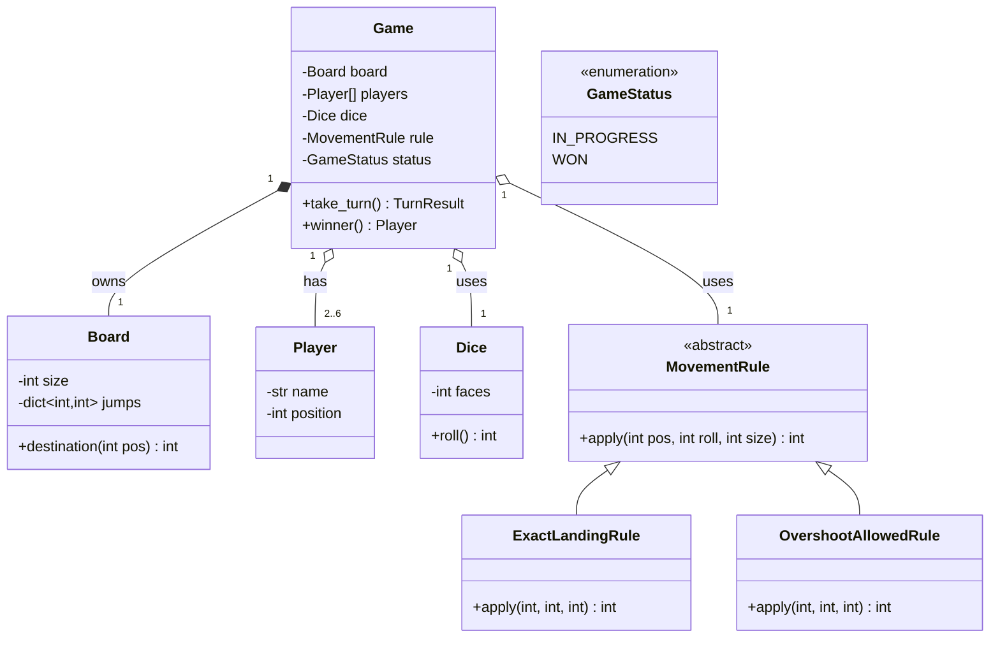

# Design Snake & Ladder

> Companion case study to LLD-22 (Tic-Tac-Toe Design). Same 7-step playbook, same skeleton — work through it AFTER Tic-Tac-Toe and notice how much carries over.

## What is Snake & Ladder?

Snake & Ladder is a 2–6 player race game played on a board of 100 numbered positions. Players take turns rolling a die and moving their token forward by the rolled amount. Landing at the bottom of a ladder lifts you to its top; landing on a snake's mouth slides you down to its tail. The first player to reach position 100 wins.

## Questions to ask

* Is the board always 100 cells, or any size?
* Exactly how do you win — must you land on 100 **exactly**, or does overshooting count?
* How many players — 2 only, or 2–6, or N?
* How many dice? Can the die be biased / have a different number of faces?
* Does rolling a 6 grant an extra turn? Three 6s in a row forfeit the move? (House rules vary a lot — pin them down.)
* Can two tokens occupy the same position, or does landing on an opponent send them back to start? (Ludo-style capture.)
* Can one of the players be a bot? (Trick question — see below.)
* Feature suggestions to offer: timed moves, undo, spectators, analytics, tournaments — the same five from Tic-Tac-Toe.

**The bot question is a trap worth noticing:** Snake & Ladder involves zero decisions — you roll and you move. A "bot" is just an auto-roller. If the interviewer says yes, the `Player` contract from Tic-Tac-Toe absorbs it with a trivial strategy. Saying this out loud scores points.

## Requirements (complete sentences)

1. The game is played on a linear board of 100 positions; the board size should be configurable.
2. Between two and six players play the game, and each player has a token on the board.
3. The board contains snakes and ladders; each one connects a start position to an end position (ladders go up, snakes go down).
4. The players take turns in a fixed order, and each turn consists of rolling one six-sided die and moving forward by the rolled amount.
5. A player who lands at the bottom of a ladder moves immediately to its top, and a player who lands on a snake's mouth moves immediately to its tail.
6. A player must land on the final position exactly to win; a roll that overshoots leaves the token where it is. (Confirm — this is a house rule.)
7. The first player to reach the final position wins the game, and the game ends immediately.
8. After every turn, the players can see all token positions.

**Non-functional:** in-memory, single process; board size and dice faces are constants in one place; a new movement house-rule (overshoot allowed, bounce-back) is one new class.

## Entities and their attributes

| Entity | Kind | Notes |
|---|---|---|
| `Game` | class | Orchestrator: turn order, roll-move-jump sequence, end-check. Same role as Tic-Tac-Toe's. |
| `Board` | class | `size: int`, `jumps: dict[int, int]` — one dict holds both snakes AND ladders (a ladder is `start < end`, a snake is `start > end`). |
| `Player` | dataclass | Name + current `position: int`. The token IS the position — no separate Token class until tokens carry more state (colour, multiple tokens per player like Ludo). |
| `Dice` | class | `faces: int = 6`, `roll() -> int`. A class (not a function) so a `LoadedDice` / `CrookedDice` test double can be injected — this is what makes the Game testable without randomness. |
| `MovementRule` | ABC (Strategy) | `apply(position, roll, board_size) -> int`. Implementations: `ExactLandingRule` (overshoot = stay), `OvershootAllowedRule`, `BounceBackRule`. |
| `GameStatus` | enum | `IN_PROGRESS`, `WON`. No `DRAW` — Snake & Ladder cannot draw. The enum shrinks; the structure stays. |

**Where did the 2-D grid go?** Tic-Tac-Toe's `grid: list[list[...]]` becomes a single `int` per player. The 10×10 picture on the physical board is pure presentation — the game logic is 1-D. Separating render from logic (Tic-Tac-Toe FR-8) is what makes this obvious.

## Class diagram



Ownership notes (same lifetime test as Tic-Tac-Toe):
- `Game ◆ Board` — composition: this board layout belongs to this game.
- `Game ◇ Player` — aggregation: players outlive games (tournaments).
- `Game ◇ Dice` — aggregation: the same die object can serve many games; injecting it is also what lets tests pass a `LoadedDice`.

## The turn sequence (the part that's NEW vs Tic-Tac-Toe)

```python
def take_turn(self) -> TurnResult:
    player = self.players[self._turn]
    roll = self.dice.roll()                                  # chance, not choice
    target = self.rule.apply(player.position, roll, self.board.size)
    target = self.board.destination(target)                  # snake/ladder jump
    player.position = target
    if target == self.board.size:
        self._status = GameStatus.WON
        return TurnResult(player, roll, target, won=True)
    self._turn = (self._turn + 1) % len(self.players)        # same modulo as TTT
    return TurnResult(player, roll, target, won=False)
```

The deep difference from Tic-Tac-Toe in one line: **`make_move(row, col)` took the player's choice as input; `take_turn()` takes no input at all** — chance replaced choice. Everything around that line is the same skeleton.

## Patterns used

| Pattern | Where | Why |
|---|---|---|
| Strategy | `MovementRule` | House rules for landing/overshoot vary per family — literally. One class per rule. |
| Dependency injection | `Dice` into `Game` | Determinism in tests (`LoadedDice([6,6,1])`), biased dice as a feature later. |
| Same as TTT | turn pointer, status enum, render/logic split | Carried over without modification. |

## Side assignment

1. Add the "rolling a 6 grants another turn; three consecutive 6s forfeits the move" house rule. Where does it live — `Game`, `Dice`, or a new `TurnRule` strategy? Justify.
2. Add Ludo-style capture: landing on an opponent's token sends it to position 0. What changes in `take_turn()`, and does `Player` need anything new?
